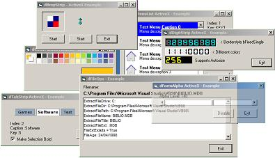



## DreamAX \+ Class Collection Ver 1\.3

### Description

hi, This is the new 1.3 Update of my class and control collection, now contains around 48 controls and 12 Classes, Lots of Fixes, New controls and classes, Just a few to name, CheckListbox, CheckListPanel, FormAlpha, RichEdit, TextBox Class, DigitsStrip, and Many More, Note The readme, has now been converted to a GUI viewer, see Dev/Readme.vbp, in there you find updates and chnages. Hope you like this Update.
 
### More Info
 

             |
---                |---
**Submitted On**   |2008-06-23 18:28:04
**By**             |[dreamvb](https://github.com/Planet-Source-Code/PSCIndex/blob/master/ByAuthor/dreamvb.md)
**Level**          |Intermediate
**User Rating**    |5.0 (35 globes from 7 users)
**Compatibility**  |VB 6\.0
**Category**       |[Custom Controls/ Forms/  Menus](https://github.com/Planet-Source-Code/PSCIndex/blob/master/ByCategory/custom-controls-forms-menus__1-4.md)
**World**          |[Visual Basic](https://github.com/Planet-Source-Code/PSCIndex/blob/master/ByWorld/visual-basic.md)
**Archive File**   |[DreamAX\_\+\_2118026232008\.zip](https://github.com/Planet-Source-Code/dreamvb-dreamax-class-collection-ver-1-3__1-69226/archive/master.zip)

